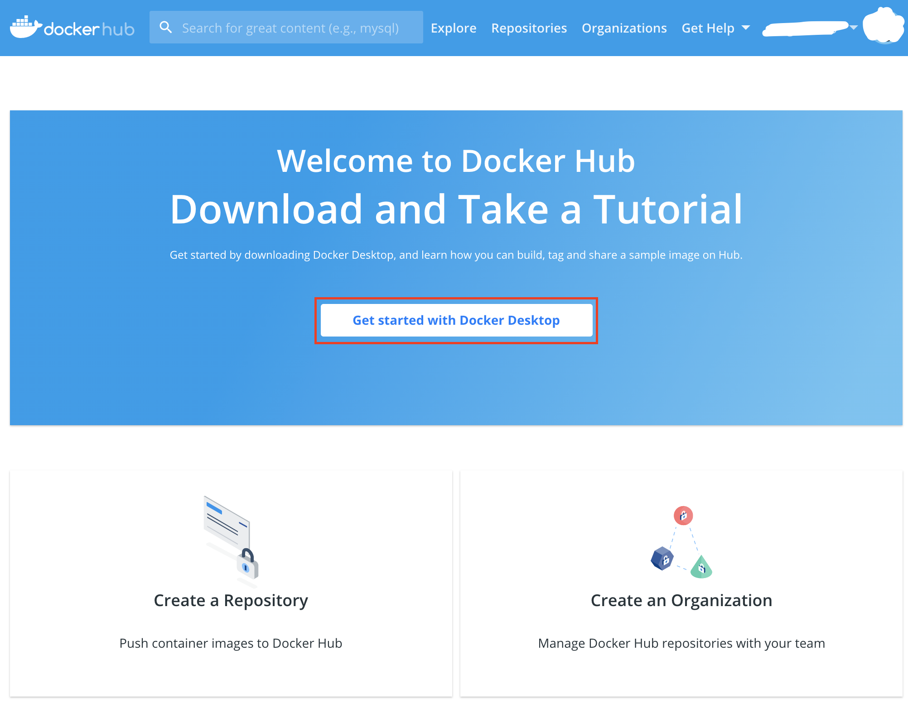
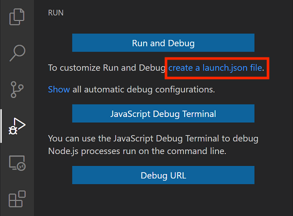
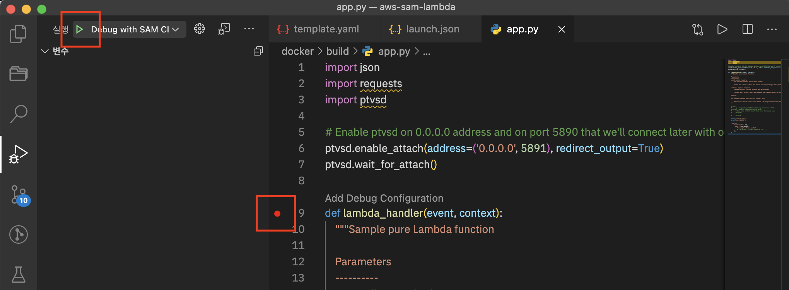
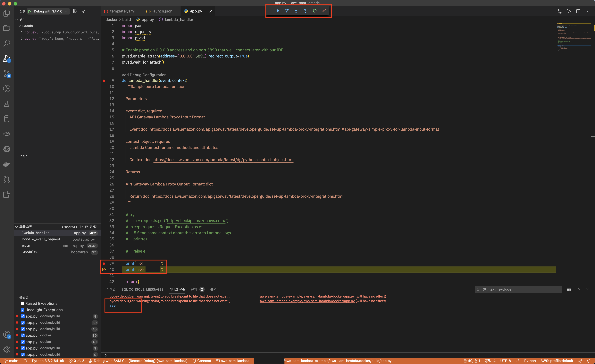

# AWS-SAM-LAMBDA-EXAMPLE
### Today / Total
[](https://hits.seeyoufarm.com)
### First commit Arc-Jung  in 2020-12-18

- A serverless application is a combination of Lambda functions, event sources, and other resources that work together to perform tasks. Note that a serverless application is more than just a Lambda function it can include additional resources such as APIs, databases, and event source mappings.

- Try this example for your project success.

## Install AWS SAM CLI / 먼저 AWS SAM CLI를 설치합니다.

- If you use Mac

```bash
/bin/bash -c "$(curl -fsSL https://raw.githubusercontent.com/Homebrew/install/master/install.sh)"
brew --version

brew tap aws/tap
brew install aws-sam-cli

sam --version
```

> https://docs.aws.amazon.com/serverless-application-model/latest/developerguide/serverless-sam-cli-install-mac.html

- If you use Windows

> https://docs.aws.amazon.com/serverless-application-model/latest/developerguide/serverless-sam-cli-install-windows.html

- If you use Linux

> https://docs.aws.amazon.com/serverless-application-model/latest/developerguide/serverless-sam-cli-install-linux.html

## Install Docker Hub / 도커 허브를 설치합니다.



- Download Docker Hub.
>https://hub.docker.com/ 

## Start AWS SAM CLI with Docker / AWS SAM CLI 명령어를 통하여 도커 허브를 이용해서 에제를 실행하세요.

### Step 1 - Download a sample application.
```bash
sam init
```

### Step 2 - Choice  a sample application / 실습하고 싶은 예제를 선택합니다.
```bash
1 - AWS Quick Start Templates
1 - Zip (artifact is a zip uploaded to S3)
10 - python3.7
<YOUR PROJECT NAME>
1 - Hello World Example
```

### Step 3 - Make docker image folder / 별도의 도커 이미지 폴더를 생성합니다.
```bash
cd <YOUR PROJECT NAME> # Example : cd aws-sam-lambda/
mkdir docker
cp -r hello_world/* docker
```

### Step 4 - Modify CodeUrl in template yaml file / 템플릿 yaml 파일에서 CodeUrl의 경로를 도커 이미지 폴더로 변경합니다.

- Change from "hello_world_function" to "docker" in template yaml file.

```yaml
  HelloWorldFunction:
    Type: AWS::Serverless::Function # More info about Function Resource: https://github.com/awslabs/serverless-application-model/blob/master/versions/2016-10-31.md#awsserverlessfunction
    Properties:
      CodeUri: hello_world_function
      Handler: hello_world/app.lambda_handler
      Runtime: python3.7
```

```yaml
  HelloWorldFunction:
    Type: AWS::Serverless::Function # More info about Function Resource: https://github.com/awslabs/serverless-application-model/blob/master/versions/2016-10-31.md#awsserverlessfunction
    Properties:
      CodeUri: docker # hello_world_function -> docker
      Handler: hello_world/app.lambda_handler
      Runtime: python3.7
```

### Step 5 - Build your application with Docker container / 도커 컨테이너를 통해서 어플리케이션을 빌드하세요.

- Insert comand in your shell
```bash
sam build --use-container
```

### Step 6 - Invoke your application with Docker container / 도커 컨테이너를 통하여 어플리케이션을 실행합니다.

- Excute lambda in your Docker container.
```bash
sam local invoke
# TIP : sam build --use-container && sam local invoke
```

- Check result

```bash
Mounting /Users/XXX/Project/aws-sam-lambda-example/aws-sam-lambda/.aws-sam/build/HelloWorldFunction as /var/task:ro,delegated inside runtime container
START RequestId: 8393e7be-6a67-4b8d-b49c-45edaf928150 Version: $LATEST
END RequestId: 8393e7be-6a67-4b8d-b49c-45edaf928150
REPORT RequestId: 8393e7be-6a67-4b8d-b49c-45edaf928150  Init Duration: 0.31 ms  Duration: 119.65 ms       Billed Duration: 200 ms Memory Size: 128 MB     Max Memory Used: 128 MB
{"statusCode": 200, "body": "{\"message\": \"hello world\"}"}%     
```

## Start debug your application with API Gateway with locally ( NOT IN CONTAINER ) / 로컬 환경에서 디버깅을 하려면 아래 순서로 진행합니다.

1. Create Python3 virtual enviroment.
```bash
python3 -m venv ./venv
source .venv/bin/activate
alias python=python3
alias pip=pip3
python --version
```
- Check Python3 version and the Python3 version of template.yaml file is same.

2. Make build folder and copy app.py
```bash
mkdir docker/build
cp docker/app.py docker/build/app.py
```

3. Install Python pakage in build folder.
```bash
pip3 install -r docker/requirements.txt -t docker/build/
```

4. Start API that triggers lambda
```bash
sam local start-api -d 5891
Mounting HelloWorldFunction at http://127.0.0.1:3000/events [GET]
You can now browse to the above endpoints to invoke your functions. You do not need to restart/reload SAM CLI while working on your functions, changes will be reflected instantly/automatically. You only need to restart SAM CLI if you update your AWS SAM template
2020-12-28 14:43:28  * Running on http://127.0.0.1:3000/ (Press CTRL+C to quit)
```

5. Create a lunch.json in Visual Studio Code and Change template yaml file. / 비쥬얼 스튜디오 코드에서 lunch.json 파일을 수정합니다.



- lunch.json
```json
{
    // Use IntelliSense to learn about possible attributes.
    // Hover to view descriptions of existing attributes.
    // For more information, visit: https://go.microsoft.com/fwlink/?linkid=830387
    "version": "0.2.0",
    "configurations": [

        {
            "name": "Debug with SAM CLI (Remote Debug)",
            "type": "python",
            "request": "attach",
            "port": 5891,
            "host":  "localhost",
            "pathMappings": [
                {
                "localRoot": "${workspaceFolder}/docker/build",
                "remoteRoot" : "/var/task"
                }
            ]
        }
    ]
}
```

- template.yaml
```yaml
AWSTemplateFormatVersion: '2010-09-09'
Transform: AWS::Serverless-2016-10-31
Description: >
  aws-sam-lambda

  Sample SAM Template for aws-sam-lambda

# More info about Globals: https://github.com/awslabs/serverless-application-model/blob/master/docs/globals.rst
Globals:
  Function:
    Timeout: 20

Resources:
  HelloWorldFunction:
    Type: AWS::Serverless::Function # More info about Function Resource: https://github.com/awslabs/serverless-application-model/blob/master/versions/2016-10-31.md#awsserverlessfunction
    Properties:
      CodeUri: docker/build/
      Handler: app.lambda_handler
      Runtime: python3.7
      Events:
        HelloWorld:
          Type: Api # More info about API Event Source: https://github.com/awslabs/serverless-application-model/blob/master/versions/2016-10-31.md#api
          Properties:
            Path: '/events'
            Method: get

```

6. Connect your API in path of template yaml file. / yaml 파일에 정의된 API path를 통하여 브라우저로 접속합니다.

- Insert URL in your browser or Insert curl command your shell.
```bash
curl http://127.0.0.1:3000/events
or Enter the address below into your Chrome browser.
http://127.0.0.1:3000/events
# TIP : Access API before starting debugging in Visual Studio Code
```

7. Check break point and start debug in Visual Studio Code. / 비쥬얼 스튜디오 코드에서 디버깅 버튼을 이용하여 디버깅 합니다.



8. Confirm break point and debug consol.



## Deploy your application / 어플리케이션을 배포합니다.

```bash
sam deploy --guided
```

# Reference

> https://docs.aws.amazon.com/serverless-application-model/latest/developerguide/serverless-getting-started-hello-world.html

> https://github.com/amazon-archives/serverless-app-examples/tree/master/python

> https://github.com/aws/serverless-application-model/blob/master/versions/2016-10-31.md

> https://www.youtube.com/watch?v=3gCzGLdhQao&ab_channel=AWSEvents

> https://docs.aws.amazon.com/serverless-application-model/latest/developerguide/serverless-sam-cli-using-debugging-python.html
